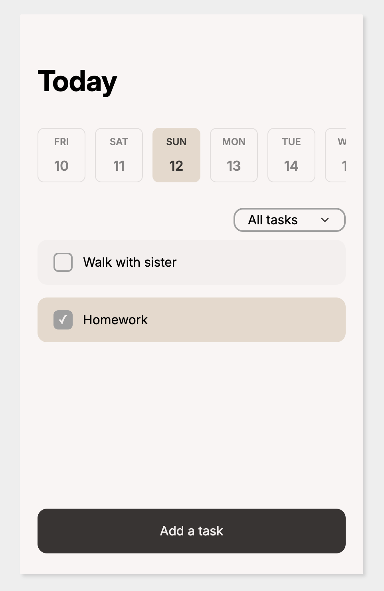

# To-Do List App

A functional and intuitive web application designed to help users plan their daily tasks, manage priorities, and stay organized.

## Features

- **Persistence:** Tasks are saved in `LocalStorage`, ensuring your data remains available even after refreshing the page.
- **Smart Filtering:** Filter tasks by date and completion status (Active/Completed).
- **Category Grouping:** Organize your workflow by viewing tasks grouped by their specific categories.
- **Task Management (CRUD):** Full ability to Create, Read, Update, and Delete tasks.
- **Date Navigation:** A dynamic date strip for easy navigation through the week.

## Technologies

- **HTML5:** Semantic markup for better accessibility.
- **CSS3:** Modern styling with Flexbox and a clean UI.
- **Vanilla JavaScript:**
  - Used `crypto.randomUUID()` for robust unique task identification.
  - Implemented ES6 Modules for clean, maintainable code.
  - Utilized `LocalStorage` for client-side data persistence.

## Learning Outcomes

This project was a significant milestone in my frontend journey. During development, I:

- **Mastered Array Manipulation:** Deepened my knowledge of `.filter()`, `.map()`, and `.sort()` to handle complex data logic.
- **Handled Date Logic:** Learned to synchronize system dates with user-defined deadlines using ISO formats.
- **Git Workflow:** Gained experience in version control, managing commits, and deploying via Git.
- **DOM & Modules:** Strengthened skills in dynamic DOM manipulation and structuring code into reusable modules.

## Getting Started

1. Clone the repository to your local machine.
2. Open `index.html` in your preferred browser.
   - _Tip: Use the "Live Server" extension in VS Code for the best experience._

## Roadmap

Future updates will include:

- **Search Functionality:** Quickly find tasks by name.
- **Dynamic Themes:** Implementation of Light/Dark modes or custom color schemes.
- **Custom Categories:** Allow users to create and manage their own task groups.
